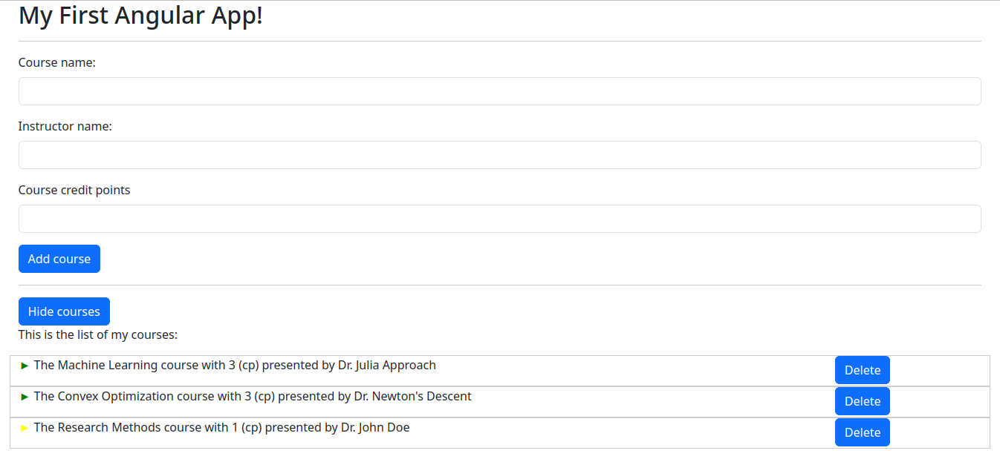

# Angular Basic App

This repository holds some basic app related to an Angular course on udemy which can be found [here](https://www.udemy.com/course/the-complete-guide-to-angular-2/).

To run the app, look at the `README.md` file in the `test-app` folder. 

Here is a screenshot of the current status of the app:
.

